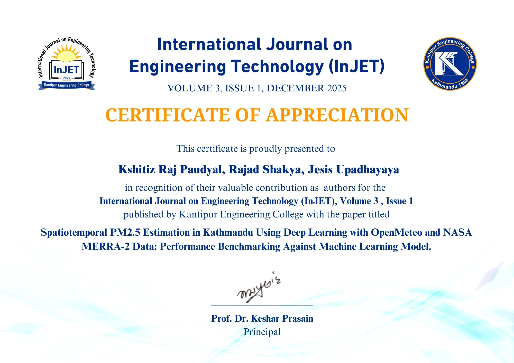

# Spatiotemporal Estimation of PM2.5 Concentrations in the Kathmandu Valley Using Deep Neural Networks: Comparative Analysis with Machine Learning Approaches Leveraging OpenMeteo and NASA MERRA-2 Meteorological Datasets

**This research work has been published in the International Journal of Engineering Technology (INJET).**

[](https://doi.org/10.3126/injet.v3i1.87012)
[](https://www.nepjol.info/index.php/injet/article/view/87012)

---

## 🏆 Awards & Recognition

We are proud to share that this paper was accepted and is published in INJET (International Journal on Engineering Technology).

<p align="center">
  
</p>

---

## ⚙️ How to Run

1. Clone the repository:

```bash
git clone https://github.com/your-username/Data_Mining_Project.git
cd Data_Mining_Project
```

2. Create and activate a virtual environment:

```bash
conda create -n data_mining python=3.9
conda activate data_mining
```

3. Install dependencies:

```bash
pip install -r requirements.txt
```

4. Preprocess data and train models:

```bash
python src/preprocessing.py
python src/train_dnn.py
python src/train_xgboost.py
```

---

## 📈 Model Performance in open-meteo dataset Hourly

| Model    | R²    | RMSE (µg/m³) | MAE (µg/m³) | Bias (µg/m³) |
|----------|-------|--------------|-------------|--------------|
| DNN      | 0.87  | 18.2348      |9.1317       | -3.4006      |
| XGBoost  | 0.8014| 22.7577      | 8.8460      | -0.1550      |

---
---

## 📈 Model Performance in NASA dataset Hourly

| Model    | R²    | RMSE (µg/m³) | MAE (µg/m³) | Bias (µg/m³) |
|----------|-------|--------------|-------------|--------------|
| DNN      | 0.7673| 24.6358      |11.5239      | -5.2387      |

For XGBOOST performance , do see the research paper here https://www.mdpi.com/2073-4433/14/7/1073
---


## 📦 Large Files

Some large datasets and model weights (e.g., `.csv`, `.h5`) are tracked via **Git LFS** or are hosted externally.  
If you want Access do contact me here: https://www.facebook.com/K.R.Paudyal.17
---

## ✍️ Citation

If you use this project, please cite:

> Kshitiz (2025). *Spatiotemporal Estimation of PM2.5 Concentrations in the Kathmandu Valley Using Deep Neural Networks: Comparative Analysis with Machine Learning Approaches Leveraging OpenMeteo and NASA MERRA-2 Meteorological Datasets*

---

## 👨‍💻 Author

**Kshitiz**  
📧 kshitiz.raj@paudyal.ml
📧 kshitizrajpaudyal@gmail.com
🏫 I.O.E Thapathali Campus

---

## 📜 License

This project is licensed under the MIT License.
